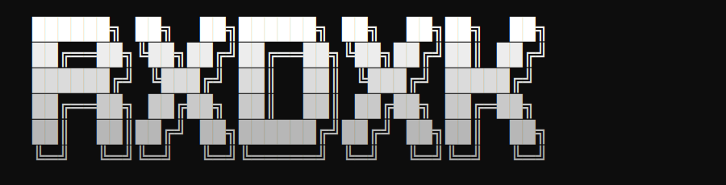

<div align="center">

  </div> <br>

</div> 

<br>

```
▓▓▓▓▓▓▓▓▓▓▓▓▓▓▓▓▓▓▓▓▓▓▓▓▓▓▓▓▓▓▓▓▓▓▓▓▓▓▓▓▓▓▓▓▓▓▓▓▓▓▓▓▓▓▓▓▓▓▓▓
   > CONNECTING TO NODE...
   > IDENTITY VERIFIED: rxdxk
   > ROLE: Python Developer / Solana & Automation
   > STATUS: [ONLINE/ACTIVE]
▓▓▓▓▓▓▓▓▓▓▓▓▓▓▓▓▓▓▓▓▓▓▓▓▓▓▓▓▓▓▓▓▓▓▓▓▓▓▓▓▓▓▓▓▓▓▓▓▓▓▓▓▓▓▓▓▓▓▓▓
```

<br>

## ░ ABOUT

```python
class Rxdxk:
    def __init__(self):
        self.role      = "Python Developer"
        self.focus     = ["Solana", "Automation", "Parsing", "Data Analytics"]
        self.mode      = "a rat in the mempool"

    def run(self):
        while True:
            self.build()
            self.optimize()
            self.ship()
```

<br>

## ░ STACK

<div align="center">


</div>

<br>

## ░ CAPABILITIES

```diff
+ Solana on-chain data indexing & wallet/tx analytics
+ RPC / WebSocket listeners for real-time chain events
+ Multi-threaded parsers (web, API, on-chain sources)
+ Automation pipelines — scraping to structured datasets
+ Trading & monitoring bots (Telegram / Discord integrations)
+ Data cleaning, ETL, and visual analytics dashboards
```

<br>

## ░ SYSTEM STATS

<div align="center">


</div>

<br>

## ░ ACTIVITY FEED

```
> tail -f /var/log/rxdxk/activity.log
```

<!--START_SECTION:activity-->
<!--END_SECTION:activity-->

<br>

## ░ CONTRIBUTION GRID

<div align="center">

</div>

<br>

## ░ TERMINAL

```bash
$ cat contact.txt
> telegram   : t.me/rxdxk
> github     : github.com/rxdxk
> status     : [ SIGNAL ACTIVE ]
```

<br>

<div align="center">

</div>
